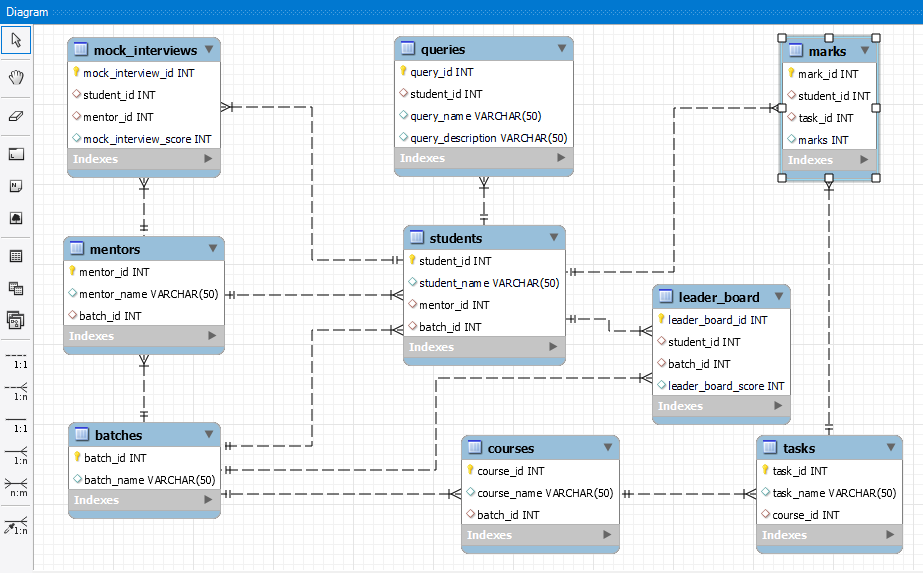

# MySql-DB-Design-Task

It has Guvi-Zen class Roadmap session: Day-34 and Database : MySql : Day-2 Tasks. In this task, I learn to design a DB Design in MySql with it's queries.

## Lessons Learned

- CRUD Operations
- Creating Table
- Altering Table
- Table constraints
- primary key
- Foreign key
- MySql WorkBench
- DB Design Diagram

## Screenshots

## Feedback

If you have any feedback, please reach out to me at vijaymayhul@gmail.com
